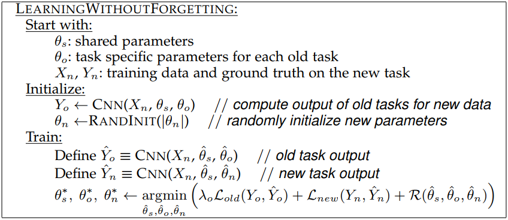
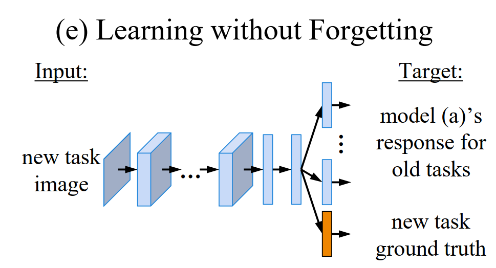
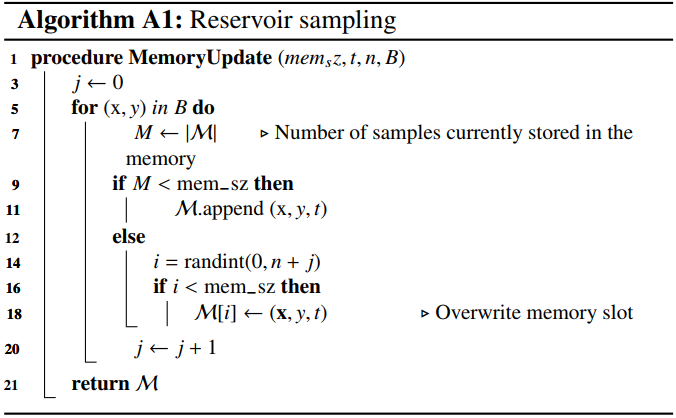

# Online learning

## LwF.MC

Learning without Forgetting for multi-class.

- The code is referenced
  from [here](https://github.com/DRSAD/Implementation-of-Learning-without-Forgetting-for-multi-class).
  
  
- the calculation of loss is similar as iCaRL.
- after training, the old_model needs to be updated:

```python
def afterTrain(self, accuracy):
    self.numclass += self.task_size
    filename = 'model/5_increment:%d_net.pkl' % (self.numclass - self.task_size)
    torch.save(self.model, filename)
    self.old_model = torch.load(filename)
    self.old_model.to(device)
    self.old_model.eval()
```

## iCaRL

Reference from [here](https://github.com/DRSAD/iCaRL).

- When adding new category, create new node in FC layer.

```python
def Incremental_learning(self, numclass):
    weight = self.fc.weight.data
    bias = self.fc.bias.data
    in_feature = self.fc.in_features
    out_feature = self.fc.out_features
    self.fc = nn.Linear(in_feature, numclass, bias=True)
    self.fc.weight.data[:out_feature] = weight
    self.fc.bias.data[:out_feature] = bias
```

Representation Learning

- The loss is combined by a standard classification loss and a distillation loss.

```python
def _compute_loss(self, indexs, imgs, target):
    # target is the ground truth
    output = self.model(imgs)
    target = get_one_hot(target, self.numclass)
    output, target = output.to(device), target.to(device)
    if self.old_model == None:
        return F.binary_cross_entropy_with_logits(output, target)
    else:
        old_target = torch.sigmoid(self.old_model(imgs))
        old_task_size = old_target.shape[1]
        target[..., :old_task_size] = old_target
        return F.binary_cross_entropy_with_logits(output, target)
```

- Nearest-Mean-of-Exemplars Classification

```python
def classify(self, test):
    # test is the images for test.
    result = []
    test = F.normalize(self.model.feature_extractor(test).detach()).cpu().numpy()
    # test = self.model.feature_extractor(test).detach().cpu().numpy()
    class_mean_set = np.array(self.class_mean_set)
    for target in test:
        x = target - class_mean_set
        x = np.linalg.norm(x, ord=2, axis=1)
        x = np.argmin(x)
        result.append(x)
    return torch.tensor(result)
```

Exemplar Management

- Reduce exemplar set

```python
def _reduce_exemplar_sets(self, m):
    # m=int(self.memory_size/self.numclass)
    # m is the number of exemplar in each category.
    for index in range(len(self.exemplar_set)):
        self.exemplar_set[index] = self.exemplar_set[index][:m]
        # self.exemplar_set is a list, every elements in this list is a list.
        print('Size of class %d examplar: %s' % (index, str(len(self.exemplar_set[index]))))


def _construct_exemplar_set(self, images, m):
    class_mean, feature_extractor_output = self.compute_class_mean(images, self.transform)
    # `images` are the images belong to a specific category
    # `self.compute_class_mean` get the average of normalized feature map of `images`
    exemplar = []
    now_class_mean = np.zeros((1, 512))

    for i in range(m):
        # shape：batch_size*512
        x = class_mean - (now_class_mean + feature_extractor_output) / (i + 1)
        # the detailed explaination can be find in Algorithm 4 in the original paper.
        # shape：batch_size
        x = np.linalg.norm(x, axis=1)
        index = np.argmin(x)
        now_class_mean += feature_extractor_output[index]
        exemplar.append(images[index])

    print("the size of exemplar :%s" % (str(len(exemplar))))
    self.exemplar_set.append(exemplar)
    # self.exemplar_set.append(images)
```

## Experience Replay (ER)

- ER simply trains the model with the incoming and memory mini-batches together using the cross-entropy loss.
- It applies reservoir sampling strategy to update the buffer in memory:
  

## Maximally Interfered Retrieval (MIR)

Online Continual Learning with Maximally Interfered Retrieval

- [code](https://github.com/optimass/Maximally_Interfered_Retrieval)
- MIR chooses replay samples according to the loss increases given the estimated parameter update based on the incoming
  mini-batch.
- We retrieve the samples which are most interfered, i.e. whose prediction will be most negatively impacted by the
  foreseen parameters update.
- **The code for ER-MIR example:**

```python
# MIR replay
bx, by, bt, subsample = buffer.sample(args.subsample, exclude_task=task, ret_ind=True)
# args.subsample = 50
# task = 1
# bx.shape = (500, 3, 32, 32)
# by.shape = (500, )
# bt.shape = (500, ) is the task index
# subsample is the subsample index. e.g., we select 50 samples from 500 randomly.
# bx is the image data, by is the corresponding label, bt is the index of task. 
grad_dims = []
for param in model.parameters():
    grad_dims.append(param.data.numel())
    # torch.numel Returns the total number of elements in the input tensor.
grad_vector = get_grad_vector(args, model.parameters, grad_dims)
# gather the gradients in one vector.
model_temp = get_future_step_parameters(model, grad_vector, grad_dims, lr=args.lr)
# get the updated parameters: param.data=param.data - lr*param.grad.data
with torch.no_grad():
    logits_track_pre = model(bx)
    buffer_hid = model_temp.return_hidden(bx)
    logits_track_post = model_temp.linear(buffer_hid)

    if args.multiple_heads:
        mask = torch.zeros_like(logits_track_post)
        mask.scatter_(1, loader.dataset.task_ids[bt], 1)
        assert mask.nelement() // mask.sum() == args.n_tasks
        logits_track_post = logits_track_post.masked_fill(mask == 0, -1e9)
        logits_track_pre = logits_track_pre.masked_fill(mask == 0, -1e9)

    pre_loss = F.cross_entropy(logits_track_pre, by, reduction="none")
    post_loss = F.cross_entropy(logits_track_post, by, reduction="none")
    scores = post_loss - pre_loss
    # scores.shape = (50, )
    if args.compare_to_old_logits:
        old_loss = F.cross_entropy(buffer.logits[subsample], by, reduction="none")

        updated_mask = pre_loss < old_loss
        updated_inds = updated_mask.data.nonzero().squeeze(1)
        scores = post_loss - torch.min(pre_loss, old_loss)

    all_logits = scores
    big_ind = all_logits.sort(descending=True)[1][:args.buffer_batch_size]
    # args.buffer_batch_size = 10, so big_ind.shape = (10, )

    idx = subsample[big_ind]

mem_x, mem_y, logits_y, b_task_ids = bx[big_ind], by[big_ind], buffer.logits[idx], bt[big_ind]
```

- update the buffer through `buffer.add_reservoir`: add the data into buffer

```python
def add_reservoir(self, x, y, logits, t):
    n_elem = x.size(0)
    save_logits = logits is not None

    # add whatever still fits in the buffer
    place_left = max(0, self.bx.size(0) - self.current_index)
    if place_left:
        offset = min(place_left, n_elem)
        self.bx[self.current_index: self.current_index + offset].data.copy_(x[:offset])
        self.by[self.current_index: self.current_index + offset].data.copy_(y[:offset])
        self.bt[self.current_index: self.current_index + offset].fill_(t)

        if save_logits:
            self.logits[self.current_index: self.current_index + offset].data.copy_(logits[:offset])

        self.current_index += offset
        self.n_seen_so_far += offset

        # everything was added
        if offset == x.size(0):
            return

    self.place_left = False

    # remove what is already in the buffer
    x, y = x[place_left:], y[place_left:]

    indices = torch.FloatTensor(x.size(0)).to(x.device).uniform_(0, self.n_seen_so_far).long()
    # uniform_: Fills self tensor with numbers sampled from the continuous uniform distribution:
    valid_indices = (indices < self.bx.size(0)).long()

    idx_new_data = valid_indices.nonzero().squeeze(-1)
    idx_buffer = indices[idx_new_data]

    self.n_seen_so_far += x.size(0)

    if idx_buffer.numel() == 0:
        return

    assert idx_buffer.max() < self.bx.size(0), pdb.set_trace()
    assert idx_buffer.max() < self.by.size(0), pdb.set_trace()
    assert idx_buffer.max() < self.bt.size(0), pdb.set_trace()

    assert idx_new_data.max() < x.size(0), pdb.set_trace()
    assert idx_new_data.max() < y.size(0), pdb.set_trace()

    # perform overwrite op
    self.bx[idx_buffer] = x[idx_new_data]
    self.by[idx_buffer] = y[idx_new_data]
    self.bt[idx_buffer] = t

    if save_logits:
        self.logits[idx_buffer] = logits[idx_new_data]
```